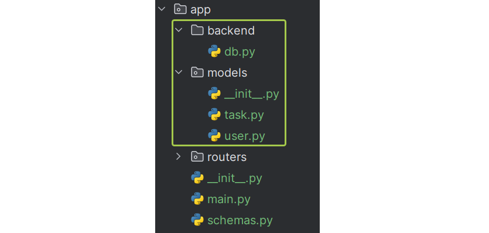
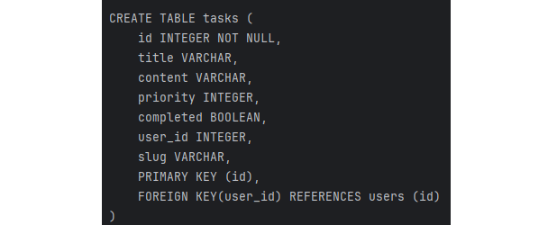

#Домашнее задание по теме "Модели SQLALchemy. Отношения между таблицами."
Цель: усвоить основные правила структурирования проекта с использованием FastAPI. Научиться создавать модели баз данных, используя SQLAlchemy.

Подготовка:
    1. Установите все необходимые библиотеки для дальнейшей работы: sqlalchemy.
    2. Добавьте файлы в ранее созданную структуру проекта согласно рисунку:

Задача "Модели SQLAlchemy":
Необходимо создать 2 модели для базы данных, используя SQLAlchemy.
База данных и движок:
В модуле db.py:
    1. Импортируйте все необходимые функции и классы , создайте движок указав пусть в БД - 'sqlite:///taskmanager.db' и локальную сессию (по аналогии с видео лекцией).
    2. Создайте базовый класс Base для других моделей, наследуясь от DeclarativeBase.
Модели баз данных:
В модуле task.py создайте модель Task, наследованную от ранее написанного Base со следующими атрибутами:
    1.  __tablename__ = 'tasks'
    2. id - целое число, первичный ключ, с индексом.
    3. title - строка.
    4. content - строка.
    5. priority - целое число, по умолчанию 0.
    6. completed - булевое значение, по умолчанию False.
    7. user_id - целое число, внешний ключ на id из таблицы 'users', не NULL, с индексом.
    8. slug - строка, уникальная, с индексом.
    9. user - объект связи с таблицей с таблицей User, где back_populates='tasks'.
В модуле user.py создайте модель User, наследованную от ранее написанного Base со следующими атрибутами:
    1. __tablename__ = 'users'
    2. id - целое число, первичный ключ, с индексом.
    3. username - строка.
    4. firstname - строка.
    5. lastname - строка.
    6. age - целое число.
    7. slug - строка, уникальная, с индексом.
    8. tasks - объект связи с таблицей с таблицей Task, где back_populates='user'.
После описания моделей попробуйте распечатать SQL запрос в консоль при помощи CrateTable (аналогично видео).
    1. Не забудьте об импорте одного класса модели в модуль с другим, чтобы таблицы были видны друг другу.
    2. Для более удобного импорта необходимо дополнить __init__.py в пакете models следующими строками:
from .user import User from .task import Task

Таким образом вы получите 2 модели связанные один(User) ко многим(Task).
Пример результата выполнения программы:
SQL для User:

SQL для Task:

